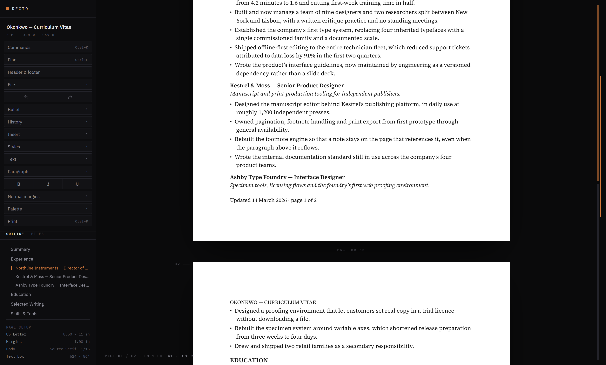
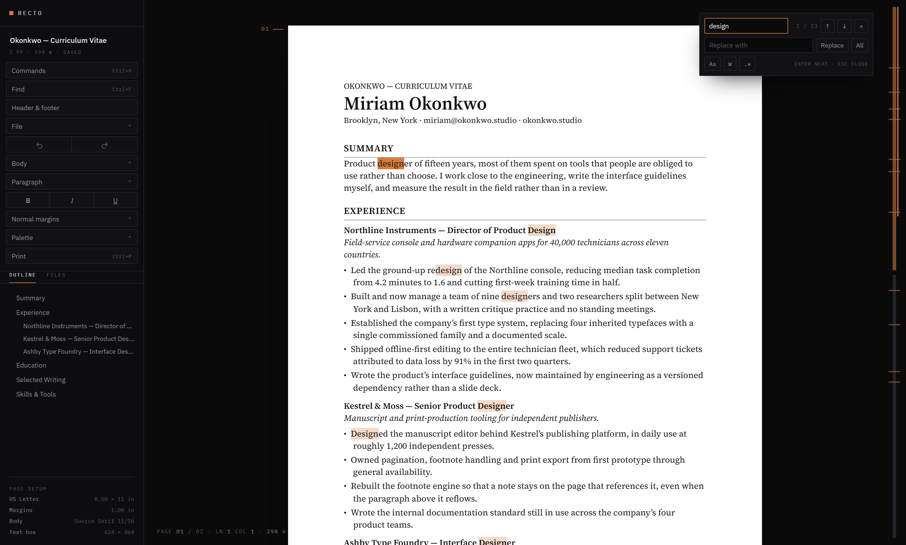
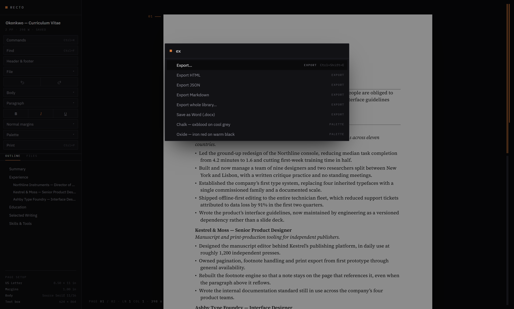
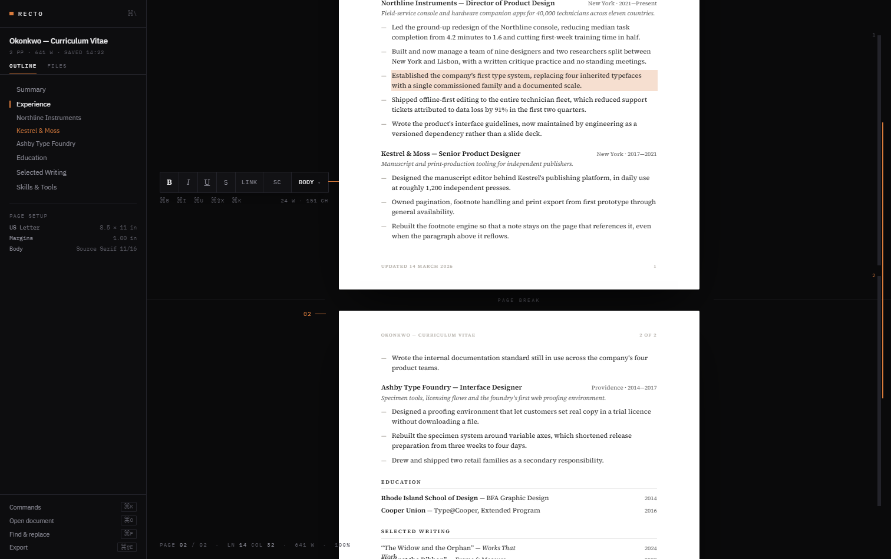
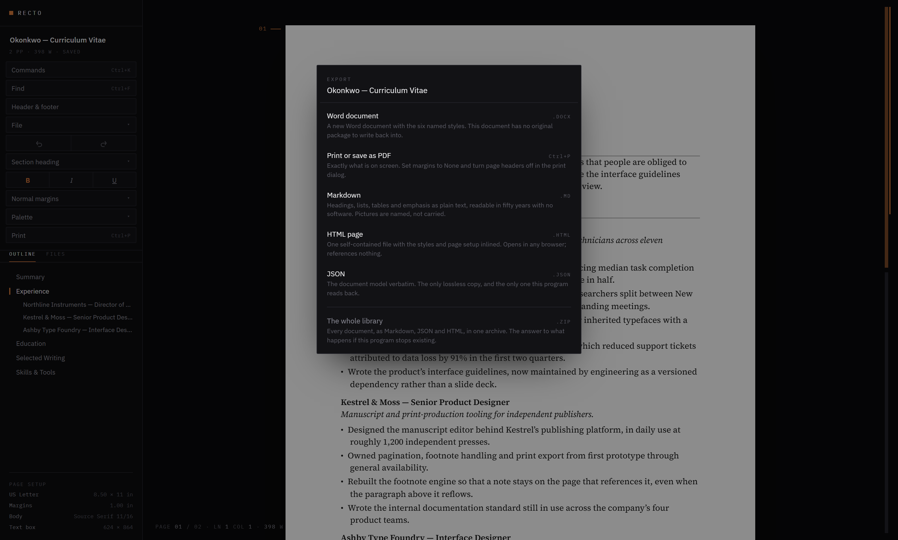
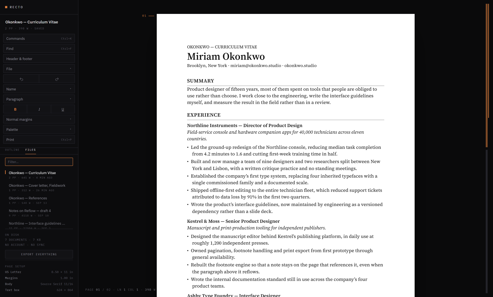
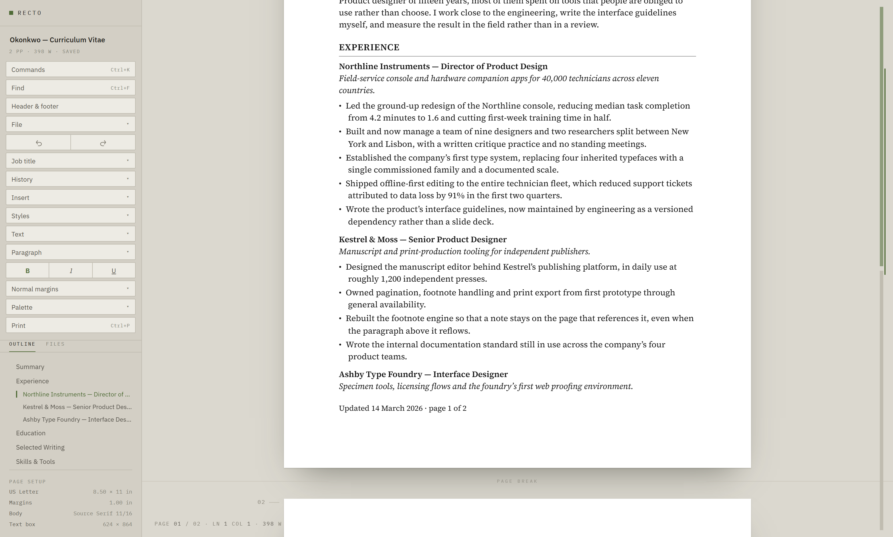
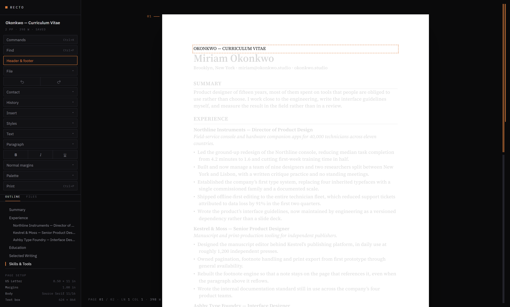
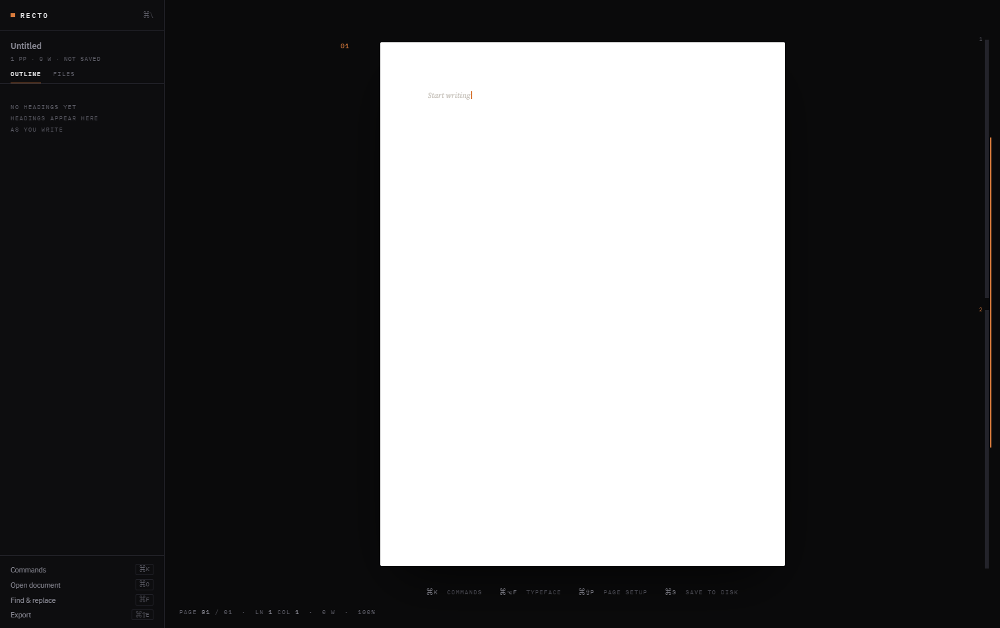

# Recto

**A browser-based word processor that renders documents as real 8.5 × 11 pages.**
Text flows from page to page as you type, and printing produces a PDF that matches
the screen one to one. Local-first, keyboard-driven, no cloud, no account, no ribbon.


<sub>The bottom of page one, the break, and the top of page two — with the running header repeated. Every screenshot here is a capture of the running application; the document in them is invented.</sub>

The browser has no native concept of a page. Pagination is implemented here by
measuring content and moving DOM nodes between fixed-height page containers.

```bash
npm install
npm run dev
```

`npm run build` type-checks and bundles to `dist/`.

The screenshots in this file are captured from the running app by
`npm run screenshots` (see [docs/screenshots.mjs](docs/screenshots.mjs)),
which drives it in a real browser against an invented document. They were
mockups once, and mockups drift — the first set showed a library with folders
and a preview pane that this program has never had.

## Contents

- [Stack](#stack)
- [The workspace](#the-workspace) — [command palette](#the-command-palette), [formatting bar](#the-formatting-bar), [export sheet](#the-export-sheet), [library](#the-library), [palettes](#palettes)
- [Geometry](#geometry) · [How it works](#how-it-works) · [Pagination](#the-two-pagination-paths) · [Line-level splitting](#line-level-splitting) · [Styles](#styles)
- [Opening a .docx](#opening-a-docx) — [headings](#headings-when-the-document-does-not-say), [tables](#tables), [sections](#sections), [direct formatting](#direct-paragraph-formatting), [the preservation vault](#the-preservation-vault)
- [Fidelity harness](#fidelity-harness) · [Printing to PDF](#printing-to-pdf) · [.docx export](#docx-export) · [Storage](#storage)
- [Format independence](#format-independence) · [Not built, on purpose](#not-built-on-purpose) · [Acceptance tests](#acceptance-tests)

## Stack

Vanilla TypeScript, Vite, and exactly one runtime dependency (`docx`, loaded
lazily and only when you export). No framework: React's virtual DOM fights the
direct node manipulation that is the core of this app. No rich-text library —
writing the pagination layer is the point of the project.

## The workspace

The workspace is a darkroom. The only light in it is the page.


<sub>Find and replace — the current match is solid accent, the rest tinted, and every match is ticked on the document map at the right edge.</sub>


**Persistent chrome never crosses the paper edge.** Everything floats in the
gutter or sits in the rail, so the page is the only thing in the room that
looks like a document. Page numbers, the page-break rules and the document map
are drawn as an overlay on the canvas rather than inside the pages, which also
means none of them can end up in the printed output.

The one thing that does cross the edge is the formatting bar, and only while
text is selected. It is drawn in the canvas overlay rather than inside a
page - anything inside `.page` is inside the contenteditable and would print -
and it is gone before the next character lands.

The 248px rail holds what the file is (name, page and word count, save state),
an outline built from the document's own headings, the page setup, and the
controls. The gutter carries page numbers with a short leader line and a
labelled rule at each break. The right-hand spine is a document map: one bar
per page, with the visible slice marked in the accent. The status readout sits
bottom-left in the gutter.

Every control calls `preventDefault` on mousedown and never takes focus. A
control that takes focus destroys the document selection, and then Bold has
nothing to apply itself to.

### The command palette


<sub>Two letters into `ex`. Matching is a scored subsequence — every letter in order, word-initial letters worth more — so `exh` would narrow this to Export HTML alone.</sub>


`Cmd/Ctrl+K`. Every command in the program, reachable by typing part of its
name: six styles, twelve palettes, two margin presets, five export formats
and a dozen actions. The rail is where you go to find out what exists; this
is where you go when you already know.

Two details it has to get right:

- **It takes focus, and nothing else here does.** It has a text field, so it
  must. That is why it captures the selection on the way in and restores it
  before running anything - Bold applied to a selection the palette's own
  input stole is applied to nothing.
- **Matching is a scored subsequence**, not a fuzzy library: every letter in
  order, with consecutive letters and word-initial letters worth more, and a
  short label beating a long one. `exh` finds Export HTML.

The list is rebuilt each time it opens, so the ticks beside the current style
and the current palette are the current ones.

### The formatting bar


<sub>A selection brings up inline formatting and nothing else. It is gone before the next character lands.</sub>


Selecting a phrase and reaching 250px left to bold it is the most repeated
gesture in the program. A small bar appears over the selection with the
paragraph style, bold, italic and underline, positioned over the **first**
line of the selection rather than the centre of its bounding box, which on a
multi-line selection is the middle of the paragraph rather than where the eye
is.

It is coalesced on a timer rather than a frame. `selectionchange` fires for
every character of a drag and each update measures, so batching is necessary,
but `requestAnimationFrame` does not run at all when the page is considered
hidden, and a bar that never appears in an embedded view is worse than one
that measures a millisecond late.

### The export sheet


<sub>Every format costs something different, and the sheet says so at the moment of choosing. The Word line reads differently for a document that came from a .docx and still has its original package.</sub>


`Cmd/Ctrl+Shift+E`. A menu of file formats tells you what you can produce; it does
not tell you what each one costs, and here every format costs something
different. The sheet says so at the moment of choosing:

| | |
|---|---|
| Word | back into the original package, byte for byte, pictures and all |
| PDF | exactly what is on screen |
| Markdown | the words, readable in fifty years; pictures named, not carried |
| HTML | one self-contained file, styles and page setup inlined |
| JSON | the model verbatim, the only lossless copy |
| The library | every document, in one archive |

The Word line changes wording when the document has no original package to
write back into. Promising a byte-identical round trip for a document that
has no original would be a lie told at exactly the wrong moment.

### The library


<sub>The FILES tab: type-to-filter, a recency fade down the list, page and word counts kept in the index so nothing has to be loaded to list it, and the one command that gets everything out.</sub>


The rail's FILES tab lists every document, newest first, with a type-to-filter
box and a recency fade down the list. Clicking one opens it; the row menu
duplicates or deletes. `New document` and `Browse documents` are in the File
menu, on Cmd/Ctrl+N and Cmd/Ctrl+O.

Two things this has to get right:

- **Switching flushes first.** A document is only ever edited in the DOM, so
  replacing the model without writing the pending autosave loses the last few
  seconds of typing - to the swap rather than to a crash, which is worse
  because it looks deliberate.
- **A duplicate gets fresh block ids.** Block ids are keys into the source
  document's preservation vault. A copy that kept them would export itself
  back into someone else's original file.

Deleting a document also deletes the original .docx bytes held for it in
IndexedDB, and if it was the open one the app lands on the next most recent
rather than on a document that no longer exists.

### Palettes

Twelve, seven dark and five light, each defined as ten tokens - `bg`, `rail`,
`panel`, `line`, `dim`, `mid`, `hi`, `acc`, `accfg` and a retuned page shadow.
A palette is therefore a data change rather than a stylesheet fork, and the
page itself stays white in all of them, because it is paper.

| Dark | Light |
|---|---|
| Night — amber on near-black | Daylight — burnt orange on warm grey |
| Oxide — iron red on warm black | Moss on stone — sage on warm light grey |
| Cobalt — signal blue on neutral black | Moss on chalk — sage on cool light grey |
| Sulphur — brass on olive black | Bone — ink blue on parchment |
| Moss — sage on green black | Chalk — oxblood on cool grey |
| Plum — dusty rose on violet black | |
| Noir — white on pure black | |

The choice is remembered in `localStorage`.


<sub>Moss on stone — one of the five light palettes. The page stays #FFFFFF in all twelve, because it is paper.</sub>


### One deliberate departure from the specification

The Recto spec sets the page at **72px to the inch**, so that eleven-point
text is eleven pixels on screen. A CSS pixel is defined as 1/96in, so a page
rendered 612px wide prints 6.375 inches wide - which would break the one
property this whole program exists to provide, that print matches paper.

The page therefore stays at 96dpi, 816 × 1056. The spec's real intent is met a
different way: the style table now holds **points**, the unit print actually
uses, and converts once on the way to CSS. Eleven-point body text is eleven
points on paper and 14.67px on screen. Previously it was 11px, which was
8.25pt - a third too small in every exported document.

## Geometry

All geometry is in CSS pixels at 96px per inch, and the numbers are exact.

| | |
|---|---|
| Page | 816 × 1056 (8.5in × 11in) |
| Narrow margin (default) | 48px (0.5in) → content box 720 × 960 |
| Normal margin | 96px (1in) → content box 624 × 864 |

## How it works

`src/`

| File | Role |
|---|---|
| `main.ts` | entry, toolbar composition, event wiring, autosave |
| `ui.ts` | control widgets: buttons and dropdown menus |
| `commandbar.ts` | the command palette |
| `formatbar.ts` | the formatting bar over a selection |
| `exportsheet.ts` | the export sheet, and what each format costs |
| `theme.ts` | the twelve palettes, as ten tokens each |
| `shell.ts` | the workspace chrome: rail, gutter, document map, readout |
| `model.ts` | `Block`, `Doc`, geometry constants, id generation |
| `styles.ts` | the six named styles; emitted as `.s-<StyleId>` CSS at startup |
| `render.ts` | model → DOM, DOM → model, the inline sanitizer |
| `paginate.ts` | measurement, height cache, page assignment, normalization |
| `caret.ts` | serialize and restore the caret across node moves |
| `commands.ts` | toolbar actions, Enter/Backspace/Delete, shortcuts |
| `paste.ts` | clipboard sanitizer and block mapping |
| `persist.ts` | localStorage, JSON import/export, filename sanitizing |
| `export-text.ts` | Markdown and HTML out |
| `import-md.ts` | Markdown in |
| `export-library.ts` | the whole library, in one archive |
| `history.ts` | undo/redo stack |
| `export-docx.ts` | .docx generation, and the choice between the two paths |
| `headers.ts` | header and footer measurement, fields, per-section rendering |
| `docx-import.ts` | OOXML to model: paragraphs, tables, styles, numbering, sections |
| `docx-infer.ts` | what a paragraph is when the document does not say |
| `docx-package.ts` | the preservation vault: unzip, repack, keep the original |
| `docx-body.ts` | model back to a document.xml body, for imported files |
| `styles.css` | page geometry, print rules |

A few decisions are load-bearing:

**One `contenteditable`, on `#doc`** — not one per page. The browser then owns
selection, caret movement, arrow keys, shift-selection and text input across
page boundaries for free. One editable per page breaks the first time someone
backspaces at the top of page 2.

**The model is flat and ordered, and a `Block` has no `page` field.** Pages are
a rendering outcome, recomputed from measurement, never stored. Persisting page
membership turns every later bug into a stale-state bug.

**The DOM is the source of truth while editing.** The `Doc` object is a
serialization target, refreshed from the DOM on save, export and undo snapshot.
Keeping a JS model in sync with `contenteditable` on every keystroke means
fighting the browser over every input event.

**Pagination moves existing elements, never re-creates them.** `insertBefore`
preserves focus, avoids flicker and keeps IME composition alive. Re-rendering
from the model on every reflow makes typing feel broken in a way that is hard
to trace back to the line that caused it.

**Every function that moves nodes captures the caret first and restores it
last.** The caret is stored as a block id plus a character offset counted with
`Range.toString().length`, so it survives both node movement and `<b>`/`<i>`
boundaries where node-based offsets do not.

### The two pagination paths

`paginateIfNeeded()` runs synchronously on every input event, before paint. It
looks only at the page containing the caret: if that page overflows, or if room
has reopened for the first block of the next page, it triggers a reflow scoped
to that page onward. Everything else is untouched.

`paginate({ fromPage })` is the full reflow: measure every block from that page
forward, accumulate heights against the content box, assign blocks to pages,
reconcile each page's children, drop trailing empty pages, restore the caret.
It also runs debounced (150ms) after paste, style changes, margin changes and
undo.

Heights are cached by `(content width, styleId, innerHTML)` rather than by
block id, so identical blocks share an entry and editing one block never
invalidates another. The cache is cleared when the margin changes or fonts
settle.

Two details worth knowing if you touch this code:

- `.page-content` has a **fixed** height, so `scrollHeight` never reports less
  than the full content box. Used height is the sum of the block heights, which
  also guarantees the cheap check and the full reflow never disagree about
  whether a block fits.
- Spacing is **padding only**, never margin. Sibling margins collapse, and
  summed block heights would then disagree with the container height.

`normalize()` runs before every measurement. `contenteditable` periodically
drops a bare text node, a stray `<div>` or a `<br>` straight into
`.page-content`, usually at a page boundary; normalize wraps, unwraps or
removes it, hoists blocks the browser nested inside other blocks, and mints ids
for blocks a clone stripped them from. Select-all-and-delete destroys the page
elements outright, and normalize rebuilds them.

### Line-level splitting

A paragraph that does not fit the remaining space is split at a line boundary
rather than moved whole, so pages fill to the bottom margin.

The split point comes from `Range.getClientRects()`, which yields one rect per
text fragment; those are merged by vertical overlap into lines. Those rects are
**ink** boxes - the glyph extent, about 13px for 11px text - not line boxes, so
they are used only to count and locate lines. Heights come from the used line
box height, derived by dividing the block's content height by its line count.
Measuring from the ink boxes instead makes every split piece render a couple of
pixels taller than predicted, which is enough to overflow a page.

The character offset where a line begins is found by binary search:
`lineOfPrefix` is non-decreasing in the offset, so the first offset whose prefix
reaches line L is one past that line's first character. About ten range
measurements per split.

The rendered pieces are a **render artifact**. The first piece keeps the logical
block's id; continuations carry `data-continues-from` and `data-base`, the
character offset where the piece starts in the merged text. `readModel` folds
them back, so the stored document always has one block per paragraph and
persistence, export, undo and .docx know nothing about splitting. The caret is
likewise logical - block id plus offset into the merged text - which is what
lets a position survive being re-split at a different point while typing.

Pagination folds every paragraph back into one element before measuring and
re-splits afterwards. Because the head keeps its element identity and only
continuations are created and destroyed, the caret's own element normally
survives a reflow untouched, so focus and IME composition are not disturbed.

Per-style paragraph properties mirror Word's:

| Property | Default | Meaning |
|---|---|---|
| `keepWithNext` | on for Name, SectionHeading, JobTitle | never separated from the block below |
| `keepLines` | off (on for the heading styles) | never split at all |
| `orphanMin` / `widowMin` | 2 | minimum lines either side of a split |
| `pageBreakBefore` | off | always starts a page |

Two details that are easy to get wrong:

- When the maximum number of lines that fit would leave a widow, the split
  **backs off** to the latest legal line rather than abandoning the split. Not
  doing that leaves several lines of avoidable whitespace at the foot of a page.
- Each page records `data-needh`: exactly how much room would have to reopen
  before the layout could change. That is what the cheap per-keystroke check
  compares against. Getting it wrong in the keep-with-next case - where blocks
  are dragged off a page after its budget was computed - makes every keystroke
  trigger a reflow that rebuilds the identical layout.

### Styles

Six named styles, defined once in `styles.ts` and read by the CSS emitter, the
style dropdown, the Enter key and the .docx exporter.

| Style | Size / weight | Enter produces |
|---|---|---|
| Name | 24px bold | Contact |
| Contact | 10px | Body |
| SectionHeading | 12px bold, uppercase, bottom rule | Body |
| JobTitle | 11px bold | Body |
| Body | 11px, line-height 1.35 | Body |
| Bullet | 11px, hanging indent 14px | Bullet |

Pressing Enter at the end of a block creates the next style in that table;
pressing it mid-block splits and both halves keep the current style, as in Word.
Backspace at offset 0 merges into the previous block and adopts its style.

## Opening a .docx

**Open .docx** in the toolbar, or drop a file onto the page.

The OOXML is parsed directly rather than converted through HTML. Libraries
like mammoth produce HTML and throw away the style definitions, numbering and
section properties that a faithful round trip needs.

| Read from | For |
|---|---|
| `word/document.xml` | body content and section properties |
| `word/styles.xml` | style names, mapped onto the six named styles |
| `word/numbering.xml` | list definitions, resolved to real markers |
| `word/_rels/document.xml.rels` | hyperlink targets |

Sizes arrive in half-points (fonts) and twips (spacing and margins) and are
converted in one place: 1px at 96dpi is 15 twips. Page size and margins come
from `w:sectPr`, including landscape and non-letter paper - page geometry is
per document, not a global constant.

Numbered lists resolve to their real markers ("1.", "1.1", "(i)") rather than
being flattened to bullets, so a contract with numbered clauses reads
correctly. The marker is held in a `listMarker` field, out of the text the
user edits, and ignored on export: the paragraph's own `w:numPr` goes back and
Word renumbers the list itself.

### Headings, when the document does not say

Real documents are not styled. Across 44 of them, 1,348 of 1,573 paragraphs
carried no `w:pStyle` at all and only 11 used `Heading1`. A mapping table
keyed on style names is correct and almost never fires, so every heading
lands on Body and documents import flat.

Paragraphs with no recognized style therefore go through an inference pass
that reads the formatting: Word's own `w:outlineLvl` first, then a rule under
the line, size relative to the body text, bold and capitals - all gated on the
paragraph being short, because prose is never a heading however it is set.

Two measurements decided the thresholds rather than taste:

- Formatting is weighted by **characters, not runs**. Word splits a line into
  runs for its own reasons, and counting runs weights a one-character fragment
  like a whole sentence.
- "Mostly bold" is **half** the line. The ordinary resume idiom - a bold job
  title followed by an unbolded date range - lands at 58%, so a stricter cut
  misses exactly the case the rule exists for.

Body size is a character-weighted mode of the document itself, so a 10pt
document and a 12pt one are each measured against their own norm. A separate
pass promotes the document's title, and the line beneath it becomes a contact
line only when it actually looks like one - otherwise a contract's date line
would be set in contact type.

`test/infer.test.mjs` pins this down against a resume with no named styles
anywhere, and checks that named styles still win, that a contract is not read
as a resume, and that a cover letter grows no headings.

### Tables

`Block` is a union of `ParagraphBlock` and `TableBlock`. A cell holds an array
of paragraphs, so the renderer, styles, caret and inline sanitizer all work
inside a cell without knowing tables exist.

Column widths come from the document's own `w:tblGrid`, and the table is laid
out `table-layout: fixed` at that width - a browser's automatic layout would
quietly disagree with what Word measured and move the row breaks. A grid is
only trusted if it describes a table of roughly the right size, because some
writers emit nominal widths and size the table by percentage instead; a table
wider than the page is scaled to fit. A `gridSpan` is carried as placeholder
cells that the renderer turns into a `colspan`, so a row always has one entry
per grid column.

A table splits at **row** boundaries, repeating its leading header rows at the
top of each continuation. The repeated rows are marked, stripped of their
block ids and made non-editable, so measurement, `readModel` and the caret all
treat them as the render artifact they are. A page holding only the header and
one row has stranded that row, so that is not a valid split and the table
moves whole instead.

Editing inside a cell round-trips: an untouched table exports verbatim from
the vault, and an edited one is rebuilt keeping its `w:tblPr`, `w:tblGrid` and
every `w:trPr` and `w:tcPr`, so borders, widths, shading and merges survive an
edit to the words.

Tab and Shift+Tab move between cells, growing a row off the end of the last
one. Arrow keys cross cell edges, measured against the cell's content rather
than its box, because the caret sits inside the cell padding and a tighter
test makes the second press do nothing. Dragging a border resizes a column
and holds the table's total width. The context menu inserts and deletes rows
and columns, with the column operations disabled on a table containing merged
cells - a grid that no longer describes the rows is what makes Word offer to
repair the file. Cell selection spanning multiple cells is out of scope.

### Sections


<sub>Header and footer editing. The body drops to 16% rather than locking, so the page still reads as a page, and the editable region is outlined in the accent. Esc returns to the body.</sub>


A Word document is a sequence of sections, each with its own page size,
margins and headers. Reading only the last `w:sectPr` - which is what a
single page setup amounts to - lays the whole document out with the geometry
of its final few paragraphs.

That is not a theoretical problem. Across 63 real documents, 11 have more
than one section; none vary the page size, three vary the margins, and on
those three the body is set at about three-eighths of an inch and the
trailing section at a half or a full inch. Rendering the first at the last
one's margins moves every line break on the page.

So geometry is a property of position, not of the document:

- A `w:sectPr` inside a paragraph's properties **ends** a section at that
  paragraph; the body-level one describes the last. A section whose first
  block does not exist - the break was on the final paragraph - is dropped.
- Which section a block is in is resolved by **walking the blocks in order**,
  not stored on the block and not looked up by id. A paragraph typed into the
  middle of section two is in section two; the model does not know about it
  yet and will not until the next save.
- Every `.page` element carries its own `--page-w`, `--pad-*` and derived
  `--content-*`, written by the paginator, so two sections render two page
  sizes with nothing global consulted. Custom-property substitution happens
  where a property is *declared*, which is why the derived pair is written
  onto the page rather than inherited from `:root`.
- A page cannot straddle two geometries, so a section boundary forces a page
  break, exactly like `pageBreakBefore`. A **continuous** break is therefore
  folded into the section above it rather than drawn with margins that cannot
  apply.
- Headers and footers are per section too, measured at that section's own
  width, and an edit is written back to the part that section references.
- A single-section document - nearly all of them - short-circuits every one
  of these functions before they touch the DOM. The indexing walk is
  O(blocks), and the per-keystroke check must not pay for a feature the open
  document does not use.

The gutter labels a break that crosses sections `SECTION BREAK` in the
accent, and the rail's PAGE SETUP describes the page the caret is on rather
than the document, reading the geometry back off the page element so the
panel cannot disagree with what is on screen.

### Direct paragraph formatting

The six named styles are the vocabulary this program writes in. They are not
the vocabulary the world sends: across 63 real documents, **1,362 of 2,913
paragraphs** carry an alignment, an indent or a paragraph spacing of their
own, and 40 of the 63 documents have at least one.

| Set directly on the paragraph | Paragraphs |
|---|---|
| Spacing (before / after / line rule) | 1,223 |
| Indentation (`w:ind`) | 417 |
| Alignment (`w:jc`, not left) | 125 |

All of it was preserved on export from the beginning and none of it was
drawn, so an imported document was faithful in the file and wrong on the
screen - and our page breaks landed in different places than Word's on
nearly half the paragraphs in a real corpus. `w:jc`, `w:ind` and `w:spacing`
are now read into the model, rendered, editable and written back.

Four things this has to get right:

- **Spacing is padding, never margin.** Sibling margins collapse, and the
  paginator sums block heights against a fixed content box; a collapsed
  margin makes that sum disagree with the container and pages overflow. So
  space-before and space-after are added to the style's own padding.
- **An indent replaces the style's hanging indent rather than adding to it**,
  or an imported bullet ends up indented twice. Word's `w:ind left` plus
  `w:hanging` composes exactly as CSS `padding-left` plus a negative
  `text-indent`, so the pair maps across unchanged.
- **`w:lineRule="auto"` counts single lines, not font sizes.** Word derives a
  single line from the font's ascent, descent and line gap - about 1.2× the
  point size for a text face - where CSS `line-height: 1.5` means 1.5× the
  font size, a fifth tighter. The factor is applied when drawing; the model
  goes on storing Word's own number, so the round trip stays exact.
- **A rewritten `w:pPr` keeps the schema order.** Word offers to repair a
  file whose paragraph properties are out of sequence, so `w:spacing`,
  `w:ind` and `w:jc` are inserted at their CT_PPr positions by a depth-aware
  scan of the existing children - a flat regex would find the `w:jc` inside
  a trailing `w:sectPr` and write the section's alignment onto the paragraph.

Only a paragraph whose formatting actually changed is rewritten; everything
else still exports byte-identically. Alignment is on the formatting bar and
on Word's own `Ctrl+L`/`E`/`R`/`J`, which is why the export sheet moved to
`Ctrl+Shift+E`. Indents, spacing and line spacing are in the rail's
**Paragraph** menu and in the command palette, along with *Clear direct
formatting*, which takes a paragraph back to its named style.

### The preservation vault

The original package is kept in memory. On export only the body of
`word/document.xml` is rewritten and dropped back into it. Everything we never
understood - theme, fonts, custom XML, document properties, comments, headers,
footnotes - goes back untouched.

Within the body, a paragraph is only regenerated when its text or style
actually changed. An untouched paragraph is written back verbatim, and an
edited one keeps its original `w:pPr`, so indentation, spacing, numbering and
direct formatting survive an edit to the words.

The result is that importing and re-exporting a document without editing it
produces a **byte-identical package**, and editing one paragraph changes only
that paragraph.

The original bytes also go into IndexedDB, because they are far too big for
localStorage. Imported block ids are derived from the body index, so
re-parsing the stored original after a reload rebuilds a vault whose keys
still line up with the edited blocks restored from localStorage.

### Preserved but not rendered

Content controls, tracked changes and anything else unrecognized are kept as
verbatim XML, anchored to the paragraph they followed, and written back on
export. They are not rendered or editable, and a banner says what was hidden -
silent data loss is the thing to avoid. Tables, images and direct paragraph
formatting were all once on this list and are now drawn and editable.

Two honest limits:

- A link **added** in the editor exports as plain text. Writing it as a real
  hyperlink means adding a relationship, and rewriting `document.xml.rels`
  would break the guarantee that untouched parts come back identical. Links
  that were already in the document survive editing.
- If you delete the paragraph that preserved content was anchored to, that
  content moves to the end of the document rather than being dropped.

## Fidelity harness

```bash
npm run corpus   # write a seed corpus into test/corpus
npm test         # inference, tables and the round trip
```

For each document it asserts that every part survives, that **non-document
parts are byte-identical**, that text content and paragraph, table, numbering,
hyperlink, content-control and revision counts all match, that an untouched
document.xml comes back byte-identical, and that editing one paragraph leaves
every other part untouched and rewrites only that paragraph.

The byte-identity assertion is what enforces the vault. It fails loudly the
first time someone regenerates the package from scratch, which is the point.

The suite runs in plain Node against the same bundled code the browser uses,
with `@xmldom/xmldom` standing in for the browser's parser.

Real documents can stay where they are - point the harness at a folder and it
reads them in place, recursing up to six levels. Nothing is copied into the
repository and nothing leaves the machine; the output is counts and file
names, never document content:

```bash
npm run build:harness
node test/roundtrip.mjs "/path/to/your/documents"
```

See `test/corpus/README.md`. The seed corpus is synthetic and is a floor, not
the corpus.

### Does our pagination agree with Word's?

Byte-identity proves the file comes back unchanged. It says nothing about
whether the pages break where Word breaks them, which is the other half of
what this program claims.

Every .docx Word saves records its page count at that moment in
`docProps/app.xml`. 52 of 63 documents in a real corpus carry one. That is
ground truth from the program we are replacing, sitting inside files we
already have, needing neither Word nor LibreOffice to read:

```bash
npm run dev                 # in another terminal
npm i -D playwright-core    # not a project dependency
npm run test:pagination -- "/path/to/your/documents"
```

It drives the real app in a real browser, because pagination is measurement
and nothing in Node has a height. Only Word's own number counts - other
producers copy the field across without recomputing it.

Two notes on what the assertions mean:

- Text is compared with entities decoded. A parser legitimately rewrites
  `&quot;` as `"`; the XML differs, the document does not. Comparing raw
  markup reports those as lost text, which is a false alarm worth not chasing
  twice.
- A byte-identical `document.xml` is reported rather than required, for the
  same reason. The binding assertions are the normalized text, the structural
  counts, and byte-identity of every part other than the document itself.

## Printing to PDF

Use the **Print / PDF** button, which forces a reflow and waits for fonts
before opening the dialog.

In the browser's print dialog you must set:

- **Margins: None**
- **Headers and footers: off**

There is no way to set these programmatically. With them set, output matches
the screen exactly, because each `.page` is already an exact letter box and the
print stylesheet supplies `@page { size: letter; margin: 0 }`.

## .docx export

`Block` → `Paragraph`, `styleId` → a named paragraph style, `<b>/<i>/<u>` →
`TextRun` flags, `<a href>` → `ExternalHyperlink`, Bullet → a paragraph with a
numbering reference. All six styles are defined in `styles.paragraphStyles`, so
they show up in Word's style gallery and the file behaves like a real Word
document rather than a dump of formatted text.

Notes:

- **Page breaks are not exported.** Word repaginates on its own and forcing our
  breaks in would fight it. Expect the .docx to break pages in different places
  than the PDF.
- Font sizes are rounded to the nearest half point (Word's smallest unit), so
  11px becomes 8.5pt rather than exactly 8.25pt.
- The document font is Calibri, matching the on-screen stack.

## Storage


<sub>A new document: one page, one caret, and an outline waiting for its first heading. Nothing has been loaded from anywhere.</sub>


Autosaves to `localStorage` on a 1s debounce under `wp:doc:<id>`, with an index
at `wp:docs`. Everything on a document that is not its blocks - headers,
footers, title-page and even/odd flags, sections - is validated and carried
back in on load; dropping any of it is silent, and a document that reloads
looking almost right with its letterhead simply gone is the worst kind of
bug to notice late. If storage is full the save fails visibly in the toolbar rather
than silently — export JSON at that point to keep your work. JSON export writes
the `Doc` verbatim; import validates that `blocks` is an array and every
`styleId` is known before replacing the document. Markdown, HTML and the
bulk library export are described under **Format independence** above.

## Format independence

The .docx path deepens an investment in a format Microsoft owns. That is the
right trade, because .docx is what the world sends and receives. The hedge is
that nothing here depends on it, or on this program:

| Out | |
|---|---|
| Markdown | headings by rank, bullets with their nesting and numbering, GFM tables, bold/italic/links |
| HTML | one self-contained file, the named styles inlined as a stylesheet, page box and `@page` from the document's own setup |
| JSON | the `Doc` verbatim - the only lossless copy, and the only one this program reads back |

| In | |
|---|---|
| Markdown | ATX and setext headings, lists, pipe tables, emphasis, links, code spans, quotes |
| JSON | validated against the model before it replaces the document |

**Export whole library…**, in the File menu and at the foot of the FILES tab,
writes every document in one command: a zip of `markdown/`, `json/` and
`html/`, a `manifest.json`, and a `README.md` listing what is in it. It reads
from storage rather than from each document's vault, because a vault lives in
IndexedDB and may be gone, and the point of this command is to work on the
worst day rather than the best one.

Two things it deliberately does not do:

- **Images are not in the archive.** They live in each document's original
  .docx, which is where they stay lossless; a Markdown file gets a note saying
  a picture was there rather than a link to a file the reader does not have.
  Export a document as Word to get its pictures.
- **Markdown import is a conversion, not a round trip.** A Markdown file has no
  vault, so importing one and exporting .docx produces a new package rather
  than a preserved original. The importer says so by clearing the vault, which
  is what stops a new document's words being written into an old document's XML.

ODT is not implemented. The spec allowed for it *"only if the export layer
turns out to abstract cleanly"* — it does not. Our export layer is the vault:
it is OOXML-specific by design, down to preserving `w:pPr` per paragraph. ODT
would be a second implementation from scratch, for a format that solves no
problem Markdown and .docx do not already solve here.

## Not built, on purpose

- **Splitting a single line.** A block whose one line is taller than a whole
  page is placed and clipped.
- **Tables on paste are dropped**, text and all - worth knowing if you paste a
  resume that uses a table for layout. A table that arrives in a .docx is read
  and edited; one that arrives on the clipboard is not.
- **A continuous section break.** It shares a page with the section before
  it, and a page has one geometry, so it folds into that section instead.
- **Direct character formatting.** Paragraphs can be aligned, indented and
  spaced, but there is still no font family, size or colour control: a run is
  bold, italic, underlined, or it is whatever its named style says. Imported
  run formatting is preserved on export and shown as the style renders it.
- **Creating** a table or inserting an image. Both are read, drawn and edited
  when they arrive in a .docx; neither can be made from nothing.
- Columns, text boxes, footnotes, PDF import, collaboration, spell check
  beyond the browser's own, mobile layout, any backend.

Undo granularity is coarser than Word's: typing coalesces into one entry per
500ms of activity, and each structural change is one entry.

## Acceptance tests

Run these in order; all pass as of the last change.

0. **Line-level pagination** - on randomized multi-page documents: no page
   overflows, no heading is ever the last line on a page, and every page's
   trailing whitespace is provably explained (its slack is strictly less
   than its recorded `needh`). Text survives split and re-merge intact.
1. **Geometry** — page is 816×1056, content box 720×960; the last line on a
   full page sits within one line height of the bottom margin.
2. **Flow down** — hold Enter to page 3 and beyond. No page ever exceeds the
   content box mid-keystroke; the caret stays with the cursor.
3. **Flow up** — hold Backspace back to page 1. Blocks pull up, empty pages
   disappear, the caret lands at the join point every time.
4. **Boundary typing** — type on the last line of page 1 until the block wraps
   to a line that no longer fits. It moves to page 2 mid-word without losing
   focus or dropping a character.
5. **Mid-document insert** — paste into page 2 of a 5-page document. Later
   pages reflow, the scroll position does not jump.
6. **Style change reflow** — change a block on page 1 to Name; everything below
   reflows and the caret is preserved.
7. **Paste hostile input** — paste from Google Docs and from Word. No foreign
   fonts, colors, spacing or classes survive; bullets become Bullet blocks
   (including Word's `MsoListParagraph` paragraphs with the glyph inlined as
   text); Google Docs' `<b style="font-weight:normal">` wrapper does not bold
   the document; emphasis carried as `<span style="font-weight:700">` is kept.
8. **Font race** — no web fonts are loaded, so pagination is correct on first
   paint rather than corrected a moment later. The stylesheet is a
   render-blocking `<link>` so the first measurement is never unstyled.
9. **Undo depth** — type, restyle, paste, then undo four times. Each step
   reverses cleanly with the caret restored, and undo stops at the baseline.
10. **Reload** — refresh mid-edit; the document restores identically, page
    breaks included.
11. **Export match** — the .docx carries all six named styles, bold/italic/
    underline, hyperlinks, line breaks, bullet numbering, 8.5×11in page size
    and the right margins, with no forced page breaks.
12. **Performance** — on a 10-page document the input handler runs at ~0.5ms
    median and under 2ms at p99, whether typing on page 1 or page 10.
